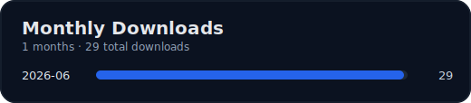

<p align="center">
  
</p>

<h1 align="center">ok-gm</h1>

<p>
An image-recognition-based automation tool for Gakuen Idolmaster, with background mode support, developed based on <a href="https://github.com/ok-oldking/ok-script">ok-script</a>.
<br />
一个基于图像识别的学马仕自动化程序，部分功能支持后台运行，基于 <a href="https://github.com/ok-oldking/ok-script">ok-script</a> 开发。
</p>

<p><i>Operates by simulating Windows user interactions. No memory reading, no file modification.</i></p>

<!-- Badges -->

<div align="center">


[](https://github.com/alicejump/ok-gm/releases)
[](https://github.com/alicejump/ok-gm/releases)
[](https://discord.gg/vVyCatEBgA)

</div>

## Downloads



### English Readme | [中文说明](./README.md)

---

## ⚠️ Disclaimer

This software is an external assistant tool designed to automate certain gameplay processes in *Gakuen Idolmaster*. It interacts with the game entirely through simulated standard user interface operations and complies with applicable laws and regulations. The purpose of this project is to simplify repetitive user actions. It does not alter game balance, provide unfair advantages, or modify any game files or data under any circumstances.

This software is open-source and free of charge. It is intended solely for personal learning and communication purposes and must not be used for any commercial or profit-making activities. The development team reserves the final right of interpretation of this project. Any issues arising from the use of this software are unrelated to this project and its developers.

**By using this software, you acknowledge that you have read, understood, and agreed to the above statement, and that you voluntarily assume all potential risks.**

## 🚀 Quick Start

1. **Download the installer**: Choose a download source below and download the latest `ok-gm-win32-China-setup.exe` installer.
2. **Install the application**: Double-click `ok-gm-win32-China-setup.exe` and follow the installation wizard to complete setup.
3. **Launch the application**: After installation, start `ok-gm` from the desktop shortcut or Start Menu.

## 📥 Download Sources

* **[GitHub](https://github.com/alicejump/ok-gm/releases)**: Official release page with fast global access. (**Please download the `setup.exe` installer package, not the `Source Code` archive.**)

## System Requirements & Recommended Settings

* Operating System: Windows
* Game Resolution: 9:16 recommended (1080×1920 optimal), minimum 720×1280 (lower resolutions may cause recognition and positioning issues)
* Language: Some features currently support Simplified Chinese only
* Privileges: Running as Administrator is recommended (required for source-code mode)
* Path: Use an installation/runtime path containing English characters only
* Frame Rate: Stable 60 FPS recommended for combat and navigation tasks

---

## Features Overview (By Task Type)

### Daily Tasks

* Arena
* Collect Funds
* Shop Purchases
* Work
* Upgrade a Support Card Once
* Claim Missions

### Scheduled Tasks

* Supports adding one-time tasks (such as `Daily Tasks`) to Windows Task Scheduler for automatic execution at specified times

### Automation Capabilities

* OCR Recognition, Template Matching, HSV Color Recognition
* UI Automation, Key Simulation
* Logging, Exception Handling, Workflow Scheduling

## 🔧 Troubleshooting

If you encounter issues, please go through the following checklist before asking for help:

1. **Installation Path**: Ensure the software is installed in a path containing **English characters only** (for example, `D:\Games\ok-gm`). Do not install it in `C:\Program Files` or directories containing Chinese characters.
2. **Antivirus Software**: Add the installation directory to your antivirus software's (including Windows Defender) **trusted list or whitelist** to prevent files from being deleted or blocked.
3. **Display Settings**:

   * Disable all GPU filters (such as NVIDIA Game Filter) and sharpening features unless required by specific functions.
   * Use the game's default brightness settings.
   * Disable any overlays displayed on top of the game (such as FPS counters from MSI Afterburner, Fraps, etc.).
4. **Custom Key Bindings**: If you have modified the game's default key bindings, be sure to synchronize them in the `ok-gm` settings. Only keys listed in the settings are supported.
5. **Software Version**: Verify that you are using the latest version of `ok-gm`.
6. **Game Performance**: Ensure the game can run at a stable **60 FPS**. If frame rates are unstable, try lowering graphics settings or resolution.
7. **Connection Issues**: If you frequently encounter server disconnections, try manually launching the game and letting it run for 5 minutes before starting this tool. If disconnected, simply log in again instead of restarting the game.
8. **Get Help**: If none of the above solves the problem, please submit a detailed error report through the community channels.
9. **Game/Software Language**: Some features currently support Simplified Chinese only and do not support other languages.

---

## 💻 Developer Section

### Run from Source (Python)

This project only supports Python 3.12. CMD, PyCharm, and VSCode **must be launched with Administrator privileges**.

```bash
# If the repository was cloned without submodules, run:
git submodule update --init --recursive

# Install or update dependencies
pip install -r requirements.txt --upgrade

# Run Release version
python main.py

# Run Debug version
python main_debug.py
```

### Command-Line Arguments

You can automate startup behavior through command-line parameters.

```pwsh
# Automatically execute the first task ("Daily Tasks")
# and exit the program after completion
ok-gm.exe -t 1 -e
```

* `-t` or `--task`: Automatically execute the Nth task after startup. `1` refers to the first task in the task list (`onetime_tasks` in `./src/config.py`), which is `Daily Tasks`.
* `-e` or `--exit`: Automatically exit the program after the task finishes.

### Development, Debugging & Testing

```bash
# Run all test scripts under tests/ (PowerShell)
./run_tests.ps1

# Or run unittest modules individually
python -m unittest tests/TestEssenceRecognizer.py
```

If you are developing **recognition-related tasks** (OCR/template/color recognition), it is recommended to debug under `main_debug.py` first and use logs and screenshot directories to diagnose issues.

## 💬 Join Us

* **QQ Group**:
* **QQ Channel**:
* **Developer Group**: (**Note:** This group is intended only for developers who have coding experience, own a GitHub account, and wish to contribute to the project. Before joining, please ensure that you can successfully run the project from source.)

This project is developed using the [ok-script](https://github.com/ok-oldking/ok-script) framework, which is simple and easy to maintain. Developers interested in creating their own automation projects are welcome to use [ok-script](https://github.com/ok-oldking/ok-script).

## 🔗 Projects Built with ok-script

* Endfield - https://github.com/AliceJump/ok-end-field
* Wuthering Waves - https://github.com/ok-oldking/ok-wuthering-waves
* Wuthering Waves (Daily Automation Enhanced Edition) - https://github.com/zzc-tongji/ok-ww-enhanced
* Genshin Impact (No Longer Maintained, but Background Story Automation Still Works) - https://github.com/ok-oldking/ok-genshin-impact
* Girls' Frontline 2 - https://github.com/ok-oldking/ok-gf2
* Honkai: Star Rail - https://github.com/Shasnow/ok-starrailassistant
* Star Resonance - https://github.com/Sanheiii/ok-star-resonance
* Duet Night Abyss - https://github.com/BnanZ0/ok-duet-night-abyss
* Bai Jing Corridor (Discontinued) - https://github.com/ok-oldking/ok-baijing

## ❤️ Sponsorship & Acknowledgements

### Contributors

<a href="https://github.com/AliceJump/ok-gm/graphs/contributors">
  
</a>

### Sponsors

* **EXE Code Signing**: Free code signing provided by [SignPath.io](https://signpath.io/), certificate provided by [SignPath Foundation](https://signpath.org/).

### Special Thanks
* [a4nqi3n/Gakumas_Launcher](https://github.com/a4nqi3n/Gakumas_Launcher)(`Refer to the method used in this repository to obtain the game launch parameters from the logs.`)
* [ok-oldking/OnnxOCR](https://github.com/ok-oldking/OnnxOCR)
* [zhiyiYo/PyQt-Fluent-Widgets](https://github.com/zhiyiYo/PyQt-Fluent-Widgets)
* [Toufool/AutoSplit](https://github.com/Toufool/AutoSplit)
