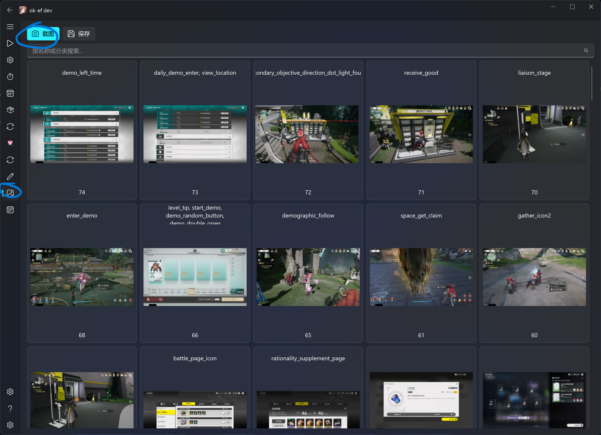
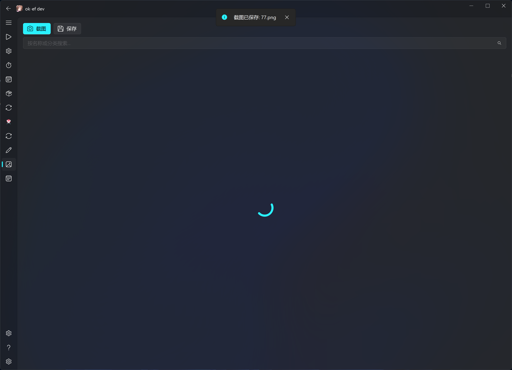
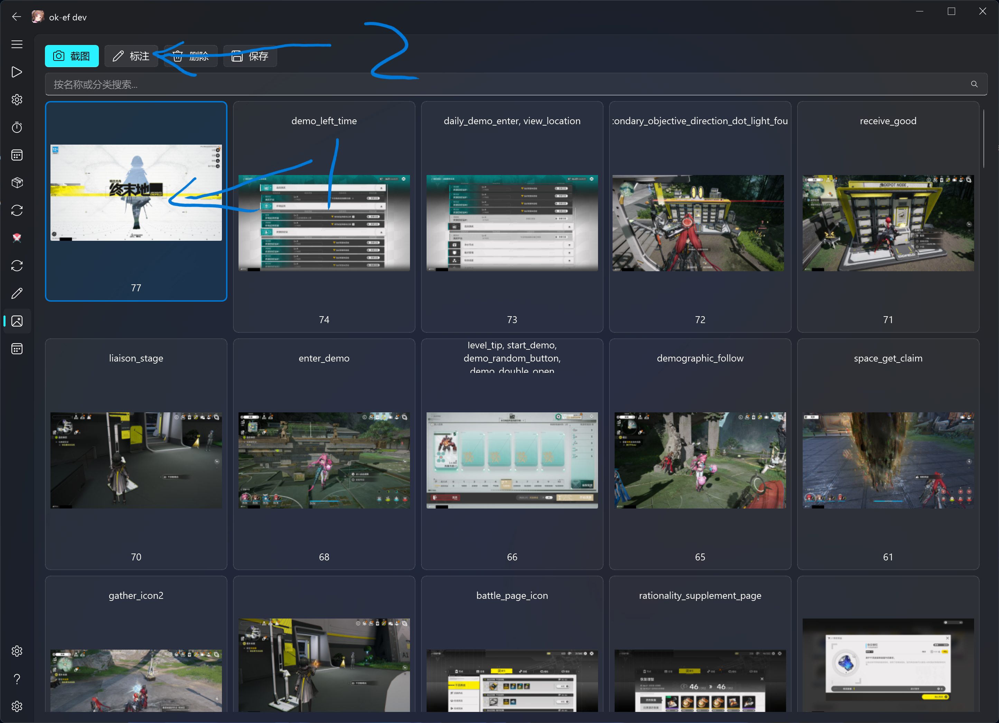
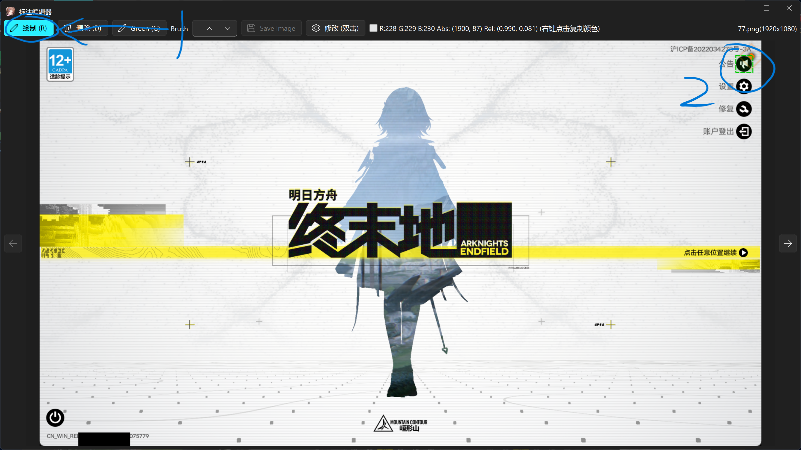
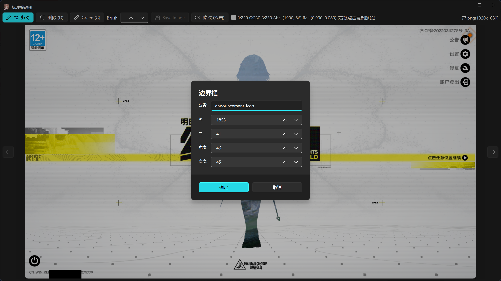
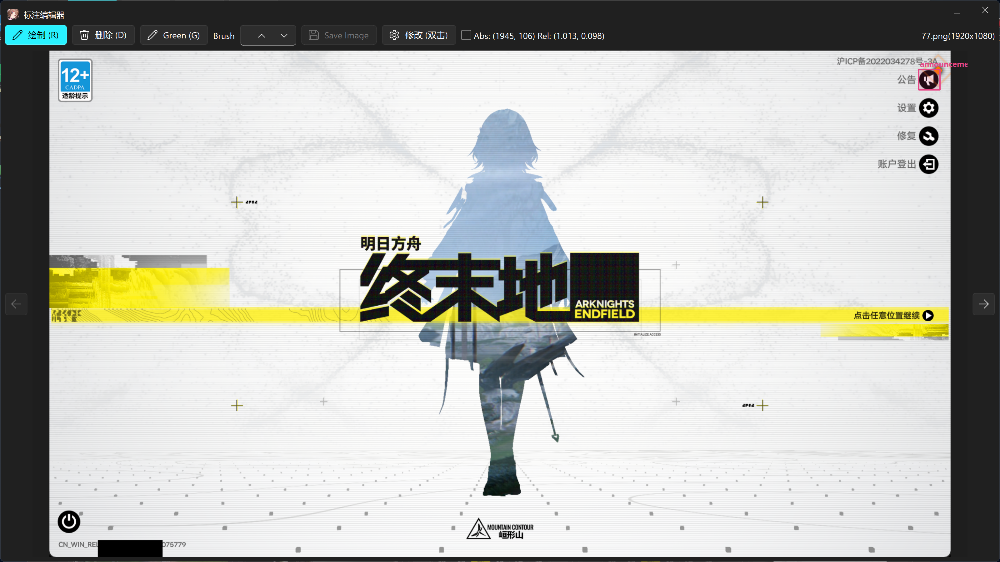
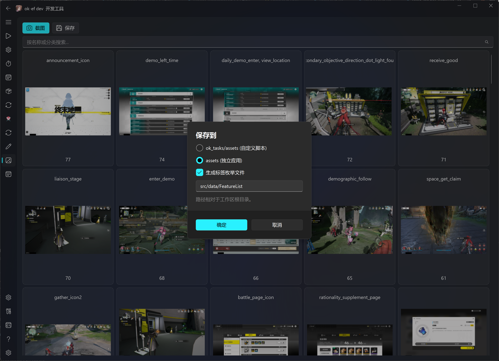
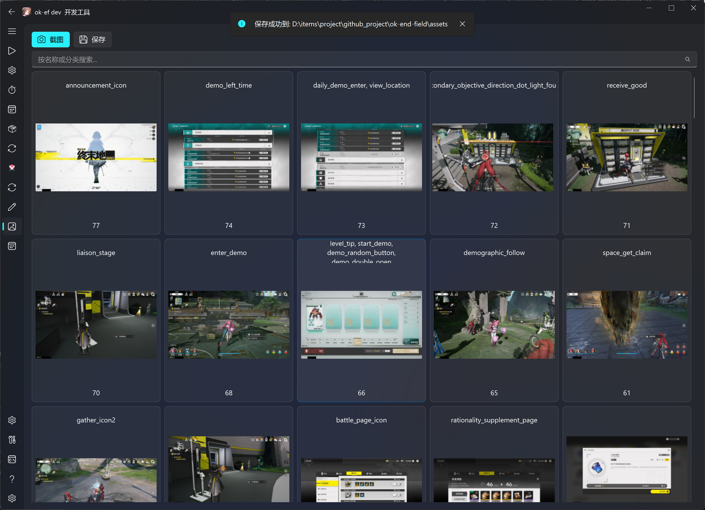

# 修改模板快速开始

> 面向 `AliceJump/ok-gm` 无权限贡献者，专用于修改游戏截图模板。
>
> | 仓库 | 角色 |
> |------|------|
> | `AliceJump/ok-gm` | 上游主仓库 |
> | `AliceJump/ok-gm-x-anylabeling-asset` | 模板源文件 (`ok_templates/`，submodule) |
> | `你的账号/...` | 你的两份 fork |

---

## 先搞懂架构

```
ok_templates/  (子仓库: 标注原图 + coco JSON)
     │ compress (TemplateTab → Save)
     ▼
assets/        (主仓库: 裁剪压缩后的小图)
     │ config.py 指向这里
     ▼
FeatureSet → BaseTask.get_feature_by_name('模板名') → cv2.matchTemplate
```

> **关键**：`ok_templates/` 是源码，`assets/` 是编译产物。改模板必须改子仓库，再 compress 到 assets。

---

## 完整工作流

### ① Fork 两个仓库

| 仓库 | 操作 |
|------|------|
| `AliceJump/ok-gm` | GitHub → Fork |
| `AliceJump/ok-gm-x-anylabeling-asset` | GitHub → Fork |

### ② Clone（含 submodule）

```bash
git clone --recursive https://github.com/你的账号/ok-gm.git
cd ok-gm
```

> 如果已 clone 但没初始化：`git submodule update --init ok_templates`

### ③ 改子仓库 remote → 签出分支

```bash
cd ok_templates
git remote set-url origin https://github.com/你的账号/ok-gm-x-anylabeling-asset.git
git checkout -b master
```

### ④ 修改模板（TemplateTab GUI）

```bash
python main.py
```

#### Step 1 — 截图

**① 点击 Screenshot**



截图自动保存到 `ok_templates/`，推荐 3840×2160 全屏截图。

**② 截图完成后出现在列表中**



---

#### Step 2 — 标注

选中图片 → 点击 Markup

**③ Markup 界面**



**④ 点击绘制 → 框选目标元素（左上→右下）**



**⑤ 输入模板名 → 确认**



> 模板名即代码中 `find_feature(feature_name='xxx')` 用的名称，命名参考：
> - `char_` 角色头像、`box_` UI 框体、`echo_` 声骸、`garden_` 花园、`con_` 属性...

**⑥ 标注完成**



---

#### Step 3 — 压缩导出

点击 Save → 选择 "assets (standalone app)" → OK

**⑦ 选择导出目标**



**⑧ 导出完成**



---

#### Step 4 — 验证

```bash
cd ok_templates && git status      # 子仓库变更
cd .. && git diff assets/          # 压缩产物更新
```

### ⑤ 推送子仓库

```bash
cd ok_templates
git add .
git commit -m "feat: add X template"
git push -u origin master
```

### ⑥ 创建子仓库 PR

```
你的账号/ok-gm-x-anylabeling-asset → PR → AliceJump/ok-gm-x-anylabeling-asset
```

**⚠️ 必须先等此 PR 合并再继续。**

### ⑦ 子仓库合并后 → 更新主仓库 PR

```bash
cd ok_templates
git fetch origin
git checkout master
git pull upstream master
cd ..
python main.py   # TemplateTab → Save → "assets (standalone app)"
git add ok_templates assets
git commit -m "feat: update templates and submodule"
git push -u origin update-templates
```

创建 PR：

```
你的账号/ok-gm → PR → AliceJump/ok-gm
```

---

## 常见错误

| 错误 | 原因 | 解决 |
|------|------|------|
| `Permission denied` push 失败 | remote 仍指向上游 | `git remote set-url origin` 改到你的 fork |
| `+` 前缀 submodule | commit 不在上游 | 拉到上游已合并的 commit |
| submodule `dirty` | 未提交修改 | `cd ok_templates && git status` |
| 找不到模板 `not found in featureDict` | 没 compress / 名称不对应 | 确认 category name 与代码调用一致 |
| `cv2.error` | 模板比搜索区域大 | 检查 bbox 范围 |

---

## 速查

```bash
# 初始化
git clone --recursive https://github.com/你的账号/ok-gm.git
cd ok-gm

# 改 remote
cd ok_templates
git remote set-url origin https://github.com/你的账号/ok-gm-x-anylabeling-asset.git
git checkout -b master

# 修改模板 → 压缩导出
python main.py
# Screenshot → Markup(框选+命名) → Save(assets)

# 推子仓库
cd ok_templates
git add . && git commit -m "feat: add X template" && git push -u origin master
# → 创建 SubRepo PR，等合并

# 子仓库合并后
cd ok_templates
git fetch origin && git checkout master && git pull upstream master
cd ..
python main.py  # TemplateTab → Save
git add ok_templates assets && git commit -m "feat: update templates" && git push -u origin update-templates
# → 创建 MainRepo PR
```

> **一句话**：改子仓库 → compress → 子仓库 PR → 子仓库合并 → 重新 compress → 主仓库 PR。


